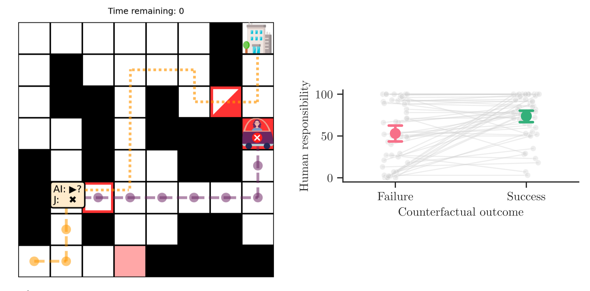

# Towards a computational model of responsibility judgments in sequential human-AI collaboration

This repository contains the experiments, data, simulation code, analysis code, and figures for the paper
"[Towards a computational model of responsibility judgments in sequential human-AI collaboration]()"
by Stratis Tsirtsis, Manuel Gomez-Rodriguez and Tobias Gerstenberg (_CogSci 2024_).

__Contents__:
- [Introduction](#introduction)
- [Preregistration](#preregistration)
- [Repository structure](#repository-structure)
- [CRediT author statement](#credit-author-statement)

## Introduction

<div align="center">
  
</div>

<br clear="left" />
<br clear="right" />

When a human and an AI agent collaborate to complete a task and something goes wrong, who is responsible? Prior work has developed theories to describe how people assign responsibility to individuals in teams. However, there has been little work studying the cognitive processes that underlie responsibility judgments in human-AI collaborations, especially for tasks comprising a sequence of interdependent actions. In this work, we take a step towards filling this gap. Using semi-autonomous driving as a paradigm, we develop an environment that simulates stylized cases of human-AI collaboration using a generative model of agent behavior. We propose a model of responsibility that considers how unexpected an agent’s action was, and what would have happened had they acted differently. We test the model’s predictions empirically and find that in addition to action expectations and counterfactual considerations, participants’ responsibility judgments are also affected by how much each agent actually contributed to the outcome.

<div align="center">
  
</div>

An example of our experimental setup that simulates and illustrates cases of semi-autonomous driving. A human and their AI driving assistant have a common goal of reaching the workplace at the top right corner of the grid, and they can decide to switch control of the car once during the commute. Here, the AI is driving first (yellow dotted line), the human takes over (purple dotted line), and they get stuck in traffic (red rectangle). As a result, they fail to reach the workplace within the given time limit. The dashed yellow line illustrates the counterfactual path that the AI would have taken had it maintained control of the car. Participants assign responsibility to the human not only based on the observed commute, but also taking into account whether the counterfactual outcome would have been a success or a failure.

## Preregistration

A preregistration for the experiment presented in the paper is available on the Open Science Framework (OSF) under [https://osf.io/5ajzd](https://osf.io/5ajzd).

## Repository structure

```
├── code
│   ├── analysis
│   ├── bash
│   ├── experiments
│   ├── python
│   └── resources
├── data
│   ├── experiment1
├── docs
│   ├── experiment1
└── figures
    ├── experiment1
```

- `code` contains all the code necessary to reproduce the results in the paper. Specifically:
  - `analysis` contains R scripts used for Bayesian tests and fitting responsibility models, whose outputs are stored in `analysis/files`. It also contains a python notebook to generate all the figures included in the paper.
  - `bash` contains a set of scripts used to perform simulations within our semi-autonomous driving environment and generate the respective `png` files illustrating each simulation.
  - `experiments` contains the code that implements the interface of our online experiment.
  - `python` contains the source code of our simulation environment.
  - `resources` contains supporting files related to the model simulations and the generation of stimuli.
- `data` contains anonymized data from our experiment. For each experiment:
  - `trials.csv` contains the participants' response data (i.e. responsibilty judgments).
  - `participants.csv` contains demographic information and post-experiment
    feedback/comments from participants.
- `docs` hosts the code for the experiment's version that is currently available online. You can preview the experiment at [https://cicl-stanford.github.io/counterfactual_sequential/experiment1/](https://cicl-stanford.github.io/counterfactual_sequential/experiment1/)
- `figures` contains all the figures presented in the paper.

## CRediT author statement

- **Stratis Tsirtsis**: Conceptualization, Methodology, Software, Validation, Formal analysis, Investigation, Data Curation, Writing - Original Draft, Writing - Review & Editing, Visualization
- **Manuel Gomez-Rodriguez**: Validation, Resources, Writing - Review & Editing, Supervision, Funding acquisition
- **Tobias Gerstenberg**: Conceptualization, Methodology, Software, Validation, Formal analysis, Investigation, Resources, Writing - Review & Editing, Supervision, Project administration, Funding acquisition
